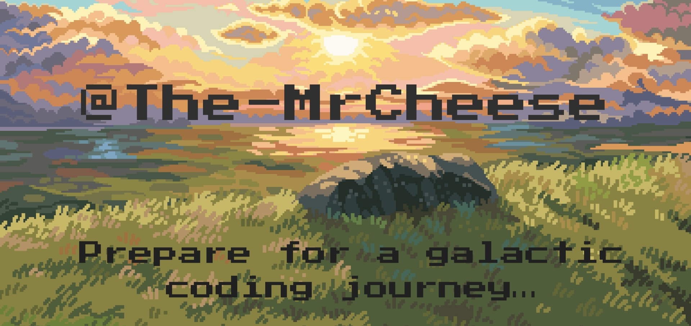

<h1 align="center">Hi 👋, I'm Mr Cheese</h1>
<h3 align="center">An eager coder on his programming journey.</h3>

  

- 🌱 I’m currently learning **Python, Scratch and Website development**

- ⚡ Fun fact: **I'm a dedicated cat enthusiast 🐈‍⬛**

<h3 align="left">Languages and Tools:</h3>

  

&nbsp;

<!--
**The-MrCheese/The-MrCheese** is a ✨ _special_ ✨ repository because its `README.md` (this file) appears on your GitHub profile.

Here are some ideas to get you started:

- 🔭 I’m currently working on ...
- 🌱 I’m currently learning ...
- 👯 I’m looking to collaborate on ...
- 🤔 I’m looking for help with ...
- 💬 Ask me about ...
- 📫 How to reach me: ...
- 😄 Pronouns: ...
- ⚡ Fun fact: ...
-->
